<!-- Every visual here is a self-hosted animated SVG committed to this repo,
     generated by the Python scripts in scripts/. No external widget services,
     no JavaScript. The heatmap and LeetCode cards refresh daily via Actions. -->

  

<h3><code>gativarshney@github:~$ whoami</code></h3>

<table>
  <tr>
    <td valign="top"></td>
    <td valign="top"></td>
  </tr>
</table>

 

<h3><code>gativarshney@github:~$ ls ~/open-source</code></h3>

<a href="https://summerofcode.withgoogle.com/programs/2026/projects/k0bZOR1y">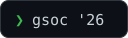</a>&nbsp;<a href="https://github.com/OpenPrinting/openprinting.github.io/commits?author=gativarshney">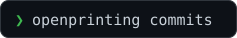</a>&nbsp;<a href="https://openprinting.github.io/hall-of-fame">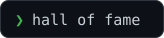</a>&nbsp;<a href="./WOC_Certificate.png">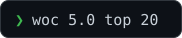</a>

  

<h3><code>gativarshney@github:~$ ./leetcode-stats.sh</code></h3>

<a href="https://leetcode.com/u/GatiVarshney/"></a>

<a href="https://leetcode.com/u/GatiVarshney/"></a>

<a href="https://leetcode.com/u/GatiVarshney/"></a>

  

<h3><code>gativarshney@github:~$ cat highlights.txt</code></h3>


  

<h3><code>gativarshney@github:~$ ls ~/projects</code></h3>

<a href="https://github.com/gativarshney/interview-ai">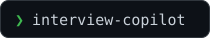</a>&nbsp;&nbsp;&nbsp;&nbsp;&nbsp;<a href="https://mysterymessage-eta.vercel.app">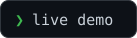</a>

  

<h3><code>gativarshney@github:~$ cat contact.txt</code></h3>

<a href="https://www.linkedin.com/in/gativarshney/">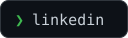</a>&nbsp;<a href="https://leetcode.com/u/GatiVarshney/">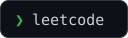</a>&nbsp;<a href="mailto:gativarshney01@gmail.com">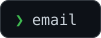</a>

  

<h3><code>gativarshney@github:~$ python3 snake.py</code></h3>

  
