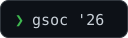
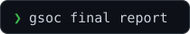
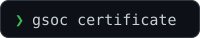
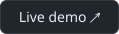
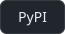
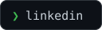

<!-- Every visual here is a self-hosted animated SVG committed to this repo,
     generated by the Python scripts in scripts/. No external widget services,
     no JavaScript. Dynamic cards are refreshed on demand (see scripts/). -->

  

<h3><code>gativarshney@github:~$ whoami</code></h3>



 

<h3><code>gativarshney@github:~$ ls ~/open-source</code></h3>

<a href="https://summerofcode.withgoogle.com/programs/2026/projects/k0bZOR1y"></a>&nbsp;<a href="https://medium.com/@gativarshney/gsoc-2026-final-report-ai-driven-printer-compatibility-recommendation-portal-9283d6fe2a5c"></a>&nbsp;<a href="./GSoC_Certificate.jpg"></a>

 

&nbsp;&nbsp;

  

<h3><code>gativarshney@github:~$ ls ~/projects</code></h3>

<a href="https://github.com/gativarshney/contributable"></a>

<a href="https://contributable.vercel.app"></a>&nbsp;

<a href="https://github.com/gativarshney/cidx"></a>

&nbsp;<a href="https://pypi.org/project/cidx/"></a>&nbsp;

 

  

<h3><code>gativarshney@github:~$ ./leetcode-stats.sh</code></h3>

<a href="https://leetcode.com/u/GatiVarshney/"></a>

<a href="https://leetcode.com/u/GatiVarshney/"></a>

  

<h3><code>gativarshney@github:~$ cat highlights.txt</code></h3>



  

<h3><code>gativarshney@github:~$ cat contact.txt</code></h3>

&nbsp;<a href="https://www.linkedin.com/in/gativarshney/"></a>&nbsp;&nbsp;

  

<h3><code>gativarshney@github:~$ python3 snake.py</code></h3>

  
